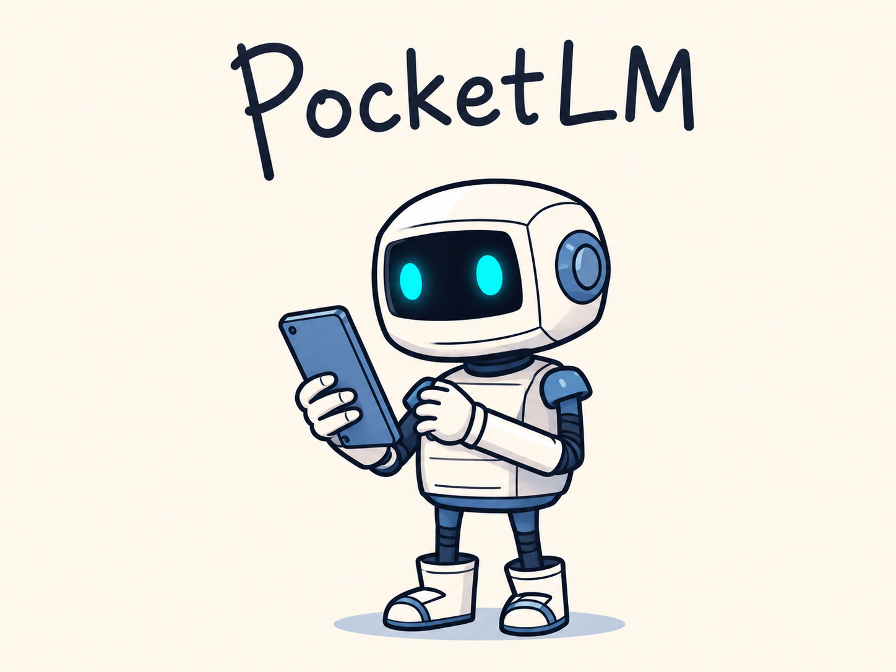
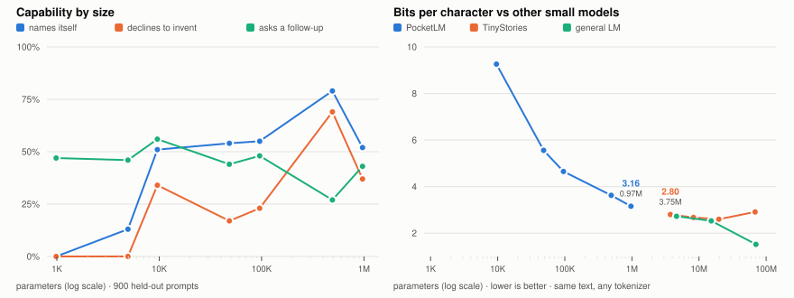

<p align="center">
  
</p>

<p align="center">
  <b>A family of chatbots from 1K to 1M parameters.</b><br>
  The smallest fits in 1.9 KB. The largest in 1.8 MB. All seven run without a framework.
</p>

---

## What it sounds like

Every trained checkpoint, same five prompts, best of 12 draws — picked for
closeness to the expected answer and
[recorded](scripts/examples-selected.json) so the table regenerates exactly:

| model | branch | params | hey | what's your name? | I'm having a rough day | tell me a joke | what's the capital of Chad? |
|---|---|---|---|---|---|---|---|
| `1k` | main | 984 | hi. | what's bed? | wat? | gont tht? | noo mes it? |
| `5k` | main | 4,944 | hey! i'm pocketlm. | hey! pocketlm. | yehat, morgh tlst. want to sorrd out. witi? | cool. what's on your mind? | no, nicexticry. |
| `10k` | main | 9,584 | hello! I'm PocketLM, what's up? | I'm PocketLM! | ugh, sorry. how are you holding up? | why did the scarecrow win an award? | I don't know that one. want to ask me something else? |
| `50k` | main | 48,416 | hello! I'm PocketLM, what's up? | my name's PocketLM. | oof. that's rough. what went wrong? | why did the scarecrow win an award? | nope, no clue. you could look that one up. |
| `100k` | main | 95,664 | hello! I'm PocketLM, what's up? | I'm PocketLM — hi! | ah, that sucks. want to tell me what happened? | why did the computer go to the doctor? | not something I know. you could look that one up. |
| `500k` | main | 491,040 | hello! I'm PocketLM, what's up? | I'm PocketLM — hi! | ah, that sucks. want to tell me what happened? | what do you call cheese that isn't yours? | not something I know. want to ask me something else? |
| `1m` | main | 968,320 | hello! I'm PocketLM, what's up? | PocketLM! nice to meet you. | ah, that sucks. want to tell me what happened? | why don't skeletons fight? | I don't know that one. want to ask me something else? |
| `1k-best` | testing | 984 | heloockese. | sockericantl you od. cedo t stho? | that beaht what? | youthoobre st? what abl do that? | goor? |
| `10k-best` | testing | 9,808 | hello! i'm pocketlm, what's up? | i'm pocketlm. | oof. that's rough. what went wrong? | what's orange and sounds like a parrot? | i'd be guessing, so — no. want to ask me something else? |
| `1k-kd` | testing | 984 | helom socket? | ocket partll dor pomar m. | going dor be p? | y dor bething? | he dont? |
| `10k-real` | dev | 9,584 | hey! I'm PocketLM. | I'm PocketLM. | oh? what's it go? how about you? | sounds about right. | I'm guessh watch you call. |
| `10k-hybrid` | dev | 9,968 | hello! | I'm PocketLM, what's up? | oh? how'd it go? | oh? how'd it go? | I am not for the remce you. |
| `50k-real` | dev | 48,416 | hey! I'm PocketLM. | I'm PocketLM. | oof. that's rough. what went wrong? | why did the computer go to the doctor? | that's outside what I know. |
| `500k-real` | dev | 491,040 | hello! I'm PocketLM, what's up? | PocketLM! nice to meet you. | oof. that's rough. what went wrong? | what do you call cheese that isn't yours? | I don't know that one. want to ask me something else? |

Read down a column and you can watch a capability switch on. `1k` produces
English-*shaped* noise. `5k` reaches for the right answer and misses —
`no, nicexticry.` is a refusal trying to happen. **From `10k` up, every reply
is a real sentence, the jokes are real jokes, and the model says "I don't know"
instead of inventing.** Above that, models differ in polish rather than
capability.

<p align="center">
  <picture>
    <source media="(prefers-color-scheme: dark)" srcset="docs/comparison-dark.svg">
    
  </picture>
</p>

Both panels share one parameter axis, so the two families sit on the same
scale. The right panel measures **bits per character** — perplexity is
per-token and would flatter whichever model has the bigger vocabulary, while
bits per character divides by characters and is invariant to tokenisation.

On the same text, `1m` scores **3.16** against TinyStories-1M's **2.80** while
being **3.9x smaller** — 968K parameters against 3.7M. Reproduce with
`python scripts/benchmark_external.py`.

> **Every model above ships in [`models/`](models/)** — 14 self-contained
> `.npz` files, 4 MB total, each runnable with numpy alone:
> `python runtime_numpy.py --model models/main/500k.npz`

## The family

| model | params | budget | vocab | d_model | layers | ctx | fp16 |
|---|---|---|---|---|---|---|---|
| `1k` | 984 | 98.4% | 64 | 8 | 1 | 64 | 1.9 KB |
| `5k` | 4,944 | 98.9% | 128 | 16 | 2 | 96 | 9.7 KB |
| `10k` | 9,584 | 95.8% | 256 | 16 | 3 | 128 | 18.7 KB |
| `50k` | 48,416 | 96.8% | 512 | 32 | 4 | 128 | 94.6 KB |
| `100k` | 95,664 | 95.7% | 640 | 48 | 4 | 192 | 186.8 KB |
| `500k` | 491,040 | 98.2% | 1024 | 96 | 5 | 256 | 959.1 KB |
| `1m` | 968,320 | 96.8% | 1024 | 128 | 6 | 256 | 1.8 MB |

One architecture throughout — RMSNorm, RoPE, SwiGLU, tied embeddings, bias-free,
causal. Each size is the largest config that fits its budget; `model.py` refuses
to build one that doesn't.

**Vocabulary scales with the model** because the embedding table costs
`vocab × d_model`. At 1K a 512-token vocabulary would be four times the entire
model, so each size gets its own tokenizer (64 → 1024 tokens, 1.2 → 3.6
chars/token).

## Results

900 held-out prompts across 9 categories, built from names, foods and phrasings
that appear nowhere in training.

| model | composite | name | declines to invent | asks back | repeats |
|---|---|---|---|---|---|
| `1k` | 0.226 | 0% | 0% | 47% | 7% |
| `5k` | 0.246 | 13% | 0% | 46% | 19% |
| `10k` | 0.408 | 51% | 34% | 56% | 43% |
| `50k` | 0.352 | 54% | 17% | 44% | 59% |
| `100k` | 0.374 | 55% | 23% | 48% | 60% |
| **`500k`** | **0.504** | **79%** | **69%** | 27% | 68% |
| `1m` | 0.399 | 52% | 37% | 43% | 71% |

`500k` is the strongest of the family and the most consistent — 11 of 12 draws
on "I'm having a rough day" are the same good reply, where `10k` scatters.
Where the models fall short (memory copying, repetition at scale, `1m`'s step
budget) is written up in [`docs/DESIGN.md`](docs/DESIGN.md).

## Quickstart

```bash
python -m venv .venv && .venv/bin/pip install -r requirements.txt

make data && make tokenizer      # corpus + 6 tokenizers
make train MODEL=50k             # ~13 min on an M1 (MLX auto-detected)
make chat  MODEL=50k
```

Or skip training — every model is in [`models/`](models/) and runs with
**no torch installed**:

```bash
python runtime_numpy.py --model models/main/500k.npz
```

`runtime_numpy.py` reimplements the forward pass — RMSNorm, RoPE, GQA, SwiGLU —
against fp16 arrays. Verified against torch to 2.7e-4, 100% argmax agreement.

## How it works

**Loss masking.** Only assistant tokens are scored:

```
<bos><mem>name: Jamie<user>what food do I like?<eos><assistant>pasta.<eos>
                                                             ^^^^^^ scored
```

Predicting what the *user* types is a different, harder task, and there is no
capacity to spare for it.

**Curriculum.** Four phases — language (all tokens), dialogue, behaviour
(oversampled follow-ups, clarifications, "I don't know"), personality.

**External memory.** Facts live in a dict, not the weights. They're regex-
extracted from user turns, ranked against the question, and injected as a
`<mem>` prefix. The model only has to turn a supplied fact into a sentence.

**Output filter.** Loop detection, echo detection, length caps, dangling-clause
trimming, safety deflection — all parameter-free, because these failures are
cheaper to catch outside the model than to train out of it.

**MLX.** On Apple Silicon, training uses MLX automatically: 1.6–1.9× faster than
PyTorch (50k: 20.8 vs 13.4 it/s). It writes ordinary PyTorch checkpoints, so
nothing downstream knows. PyTorch MPS is *no faster than CPU* here — these
models are too small to amortise kernel dispatch.

## Branches

Two experimental branches, both merged here so the code ships with the project:

| | asks | found |
|---|---|---|
| [`dev/`](dev/README.md) | does real data beat templates? | yes, above ~500K |
| [`testing/`](testing/README.md) | are the configs optimal? | no — 5–20% was on the table |

**`dev/`** swaps the generator for 11 MB of real Hugging Face dialogue (37,222
distinct user turns against 280) and corrupts user turns with typos and
shorthand — free, because user tokens aren't scored by the loss. At 491K it
beats the template-trained model on noisy input, 42% against 31%, and is the
only model that handles `Hello`, `HELLO` and `wats ur name`.

**`testing/`** searches the parameter budget instead of hand-picking it, and
finds better geometry at both sizes tested — 5.4% at 1K, 20.3% at 10K. Two
patterns fall out: **two layers beat three**, and **two heads beat four**. It
also produced the project's most useful negative result — the 10K winner has
better perplexity and a *worse* chatbot, because `vocab=192` crosses the
case-folding threshold. The search optimised its proxy perfectly; the proxy was
wrong.

Each branch keeps its corpora and models inside its own directory, so checking
one out never disturbs another.

## More

- [`models/`](models/README.md) — all 14 trained models, what each one is, which to pick
- [`docs/DESIGN.md`](docs/DESIGN.md) — parameter budgets, tokenizer, curriculum,
  evaluation methodology, full results, repository layout
- [`dev/README.md`](dev/README.md) — real corpora, licences, noisy-input training
- [`testing/README.md`](testing/README.md) — architecture search, distillation

## Good to know

- The corpus is generated by `scripts/build_corpus.py` — combinatorial
  slot-filling, so the models are as varied as it is.
  [`scripts/distill.py`](scripts/distill.py) swaps in teacher-written
  conversations, and [`dev/`](dev/README.md) swaps in 11 MB of real dialogue.
- These models hold short conversations, use facts you supply through external
  memory, and decline what they don't know. They don't know things — that's the
  whole design.
- `1k` has 984 parameters and a 16-merge vocabulary. It learns the *shape* of
  conversation, not English. That's the point of including it.
- No KV cache: recomputing a short window costs less than the code to avoid it.

Full results, methodology and the places these models fall short:
[`docs/DESIGN.md`](docs/DESIGN.md).
